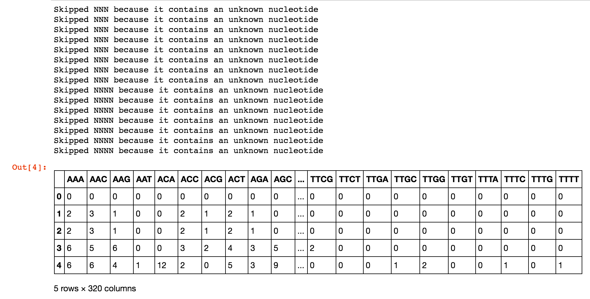
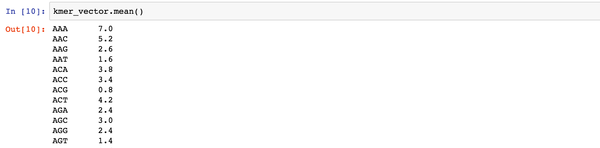
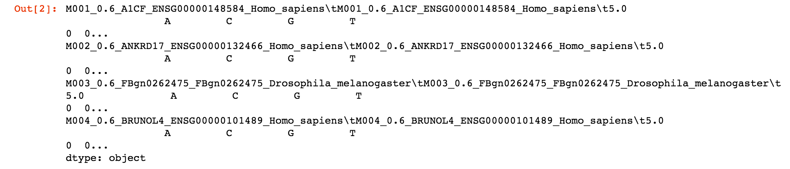
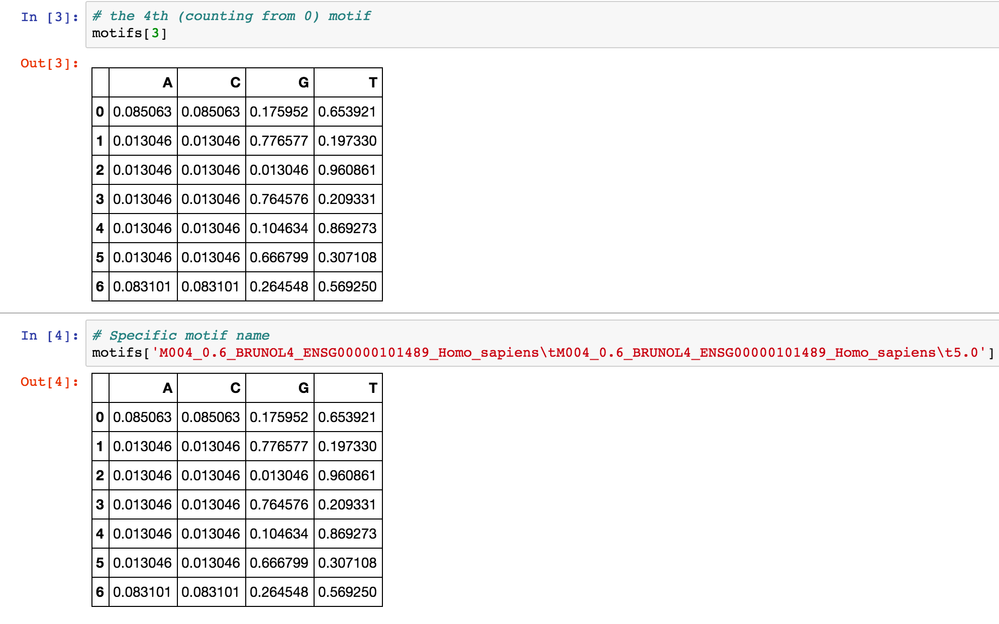
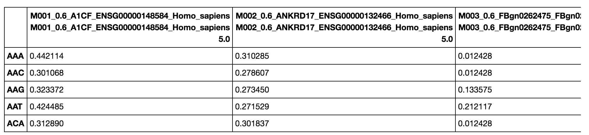

# kvector

[](https://travis-ci.org/olgabot/kvector)[](https://pypi.python.org/pypi/kvector)

## What is `kvector`?

kvector is a small utility for converting motifs to kmer vectors to compare motifs of different lengths

* Free software: BSD license
* Documentation: https://olgabot.github.io/kvector

## Installation

To install this code, clone this github repository and use `pip` to install

    git clone https://github.com/olgabot/kvector.git
    cd kvector
    pip install .  # The "." means "install *this*, the folder where I am now"


## Features

Check out [this notebook](https://github.com/olgabot/kvector/blob/master/overview.ipynb)
for an overview of features with both inputs and outputs (below shows only inputs)

### Count k-mers for each line in a `bed` file (multithreaded)

For each interval in a bed file, count the kmers and return a
(n_intervals, n_kmers) matrix of the k-mer counts of each region.

```python
kmers = kvector.per_interval_kmers(bedfile, genome_fasta, threads=threads,
    kmer_lengths=(4, 5, 6), residues='ACGT')
csv = bedfile.replace('.bed', '_kmers.csv')
kmers.to_csv(csv)
```

### Count k-mers for each line in a `bed` file, intersected (multithreaded)

For each interval in a bed file, intersect it with another (`other`) bed file (e.g. only
conserved regions of introns) and count k-mers for the intersected region. Returns
a (n_intervals, n_kmers) matrix of the k-mer counts of each line in the bed file,
intersected with the `other` bed.

```python
kmers = kvector.per_interval_kmers(bedfile, genome_fasta, other, threads=threads,
    kmer_lengths=(4, 5, 6))
csv = bedfile.replace('.bed', '_kmers.csv')
kmers.to_csv(csv)
```

### Count all *k*-mers in a `.fasta` file

```python
kmer_vector = kvector.count_kmers('kvector/tests/data/example.fasta', kmer_lengths=(3, 4))
kmer_vector.head()
```

In a Jupyter notebook, this outputs:




Since this is a pandas dataframe, you can do convenient things like get
the mean and standard deviation of the number of observations of each kmer across all
entries in the `.fasta` file.



Standard deviation:


### Read HOMER motif file

Given a HOMER motif file, read each motif as a position weight matrix
and create a Series for each ID mapping to a mini dataframe of the motif.

```python
motifs = kvector.read_motifs("kvector/tests/example.motifs", residues='ACGT')
motifs.head()
```

Here's what the output looks like in a Jupyter notebook.



This is a series containing mini-dataframes for each motif. You can can
access individual motifs with the usual pandas indexing:




### Transform the motif PWM to a kmer vector

Instead of representing a motif as a position-specific weight matrix which
would require aligning motifs to compare them, you can convert them to a vector
of kmers, where the value for each kmer is the score of the kmer in that motif.
​ Citation:
[Xu and Su, _PLoS Computational Biology_ (2010)](http://journals.plos.org/plosone/article?id=10.1371/journal.pone.0008797)

Keep in mind that on most computers, only kmers up to about 8 (4^8 = 65,536)
can be stored in memory. You may want to do this on a supercomputer and not
just your laptop.

```python
motif_kmer_vectors = kvector.motifs_to_kmer_vectors(motifs, residues='ACGT',
    kmer_lengths=(4, 5, 6))
motif_kmer_vectors.head()
```

The example output in a Jupyter notebook is below.


